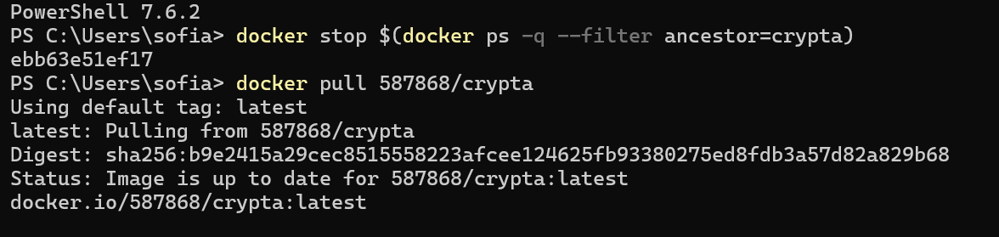

# Crypta - Generador de  Contraseñas Seguras

Aplicación web para generar contraseñas seguras de forma local.  
Las contraseñas se generan en el navegador usando `crypto.getRandomValues()` y **nunca salen del dispositivo**.

---

## Descripción

Crypta es una herramienta simple y minimalista que permite generar contraseñas seguras con opciones configurables. No requiere backend ni base de datos, todo corre en el navegador y se sirve mediante un contenedor Docker con Nginx.

---

## Tecnologías utilizadas 

| Tecnología | Uso |
|------------|-----|
| HTML5 | Estructura de la página |
| CSS3 | Estilos y diseño visual |
| JavaScript (Vanilla) | Lógica del generador |
| Nginx Alpine | Servidor web dentro del contenedor |
| Docker | Contenedorización y despliegue |

---

## Características

- Elegir el largo de la contraseña (6 a 40 caracteres)
- Activar o desactivar : mayúsculas, minúsculas, números y símbolos
- Indicador visual de seguridad (Débil / Regular / Buena / Muy segura)
-  Botón para copiar al portapapeles con un clic
- Sin dependencia externas 
- 100% local, sin conexión a servidores externos

---

## Requisitos previos 

- Tener [Docker](https://www.docker.com/products/docker-desktop) instalado y corriendo
- No se requiere ninguna otra dependencia

---

## Estructura del proyecto 

```
generador-contrasenas/
├── index.html      -> estructura de la página
├── style.css       -> estilos visuales
├── script.js       -> lógica del generador
├── Dockerfile      -> configuración del contenedor Docker
└── README.md       -> documentación del proyecto
```

---

##  Opción 1 — Correr desde el código fuente

### 1. Clonar el repositorio

```bash
git clone https://github.com/Sofia98C/generador-contrasenas
cd generador-contrasenas
```

### 2. Construir la imagen Docker

```bash
docker build -t crypta .
```

### 3. Ejecutar el contenedor 

```bash
docker run -p 8080:80 crypta
```

### 4. Abrir en el navegador 

```
http://localhost:8080
```

### 5. Detener el contenedor 

```bash
docker stop $(docker ps -q --filter ancestor=genpass)
```

---

## Opción 2 — Correr directo desde Docker Hub

Sin necesidad de clonar el repositorio ni buildear nada:

```bash
docker pull 587868/crypta
docker run -p 8080:80 587868/crypta
```

Abrí `http://localhost:8080` y la app está lista.

---

## Capturas de pantalla 

### Repositorio en GitHub 

>       

### Construcción de la imagen
```bash
docker build -t crypta .
```
> 

### Ejecución del contenedor

```bash
docker run -p 8080:80 crypta
```
> 

### Aplicación funcionando
>

---

## Opción 2 — Docker Hub

### Repositorio en Docker Hub
> 

### Construcción de la imagen con tu usuario de Docker Hub
```bash
docker build -t 587868/crypta .
```
>

### Subir la imagen a Docker Hub 
```bash
docker push 587868/crypta
```
>

### Cuando cualquiera baja la imagen desde Docker Hub
```bash
docker pull 587868/crypta
```
>

### Aplicación funcionando
>

##  Cómo funciona el Dockerfile

```dockerfile
FROM nginx:alpine        # imagen base liviana de Nginx
COPY index.html ...      # copia los archivos al contenedor
EXPOSE 80                # expone el puerto 80
CMD ["nginx", ...]       # arranca el servidor
```

---

## Desarrollado por 

**Sofia Contini**
Trabajo Práctico N°1 — Git y Docker 
Materia: Ingeniería de Software

